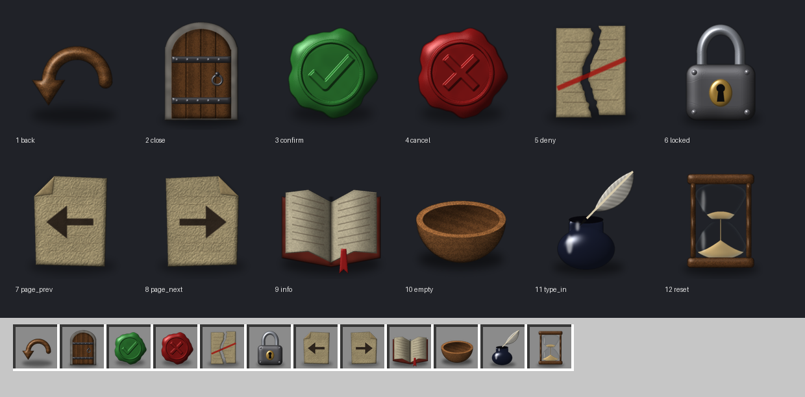
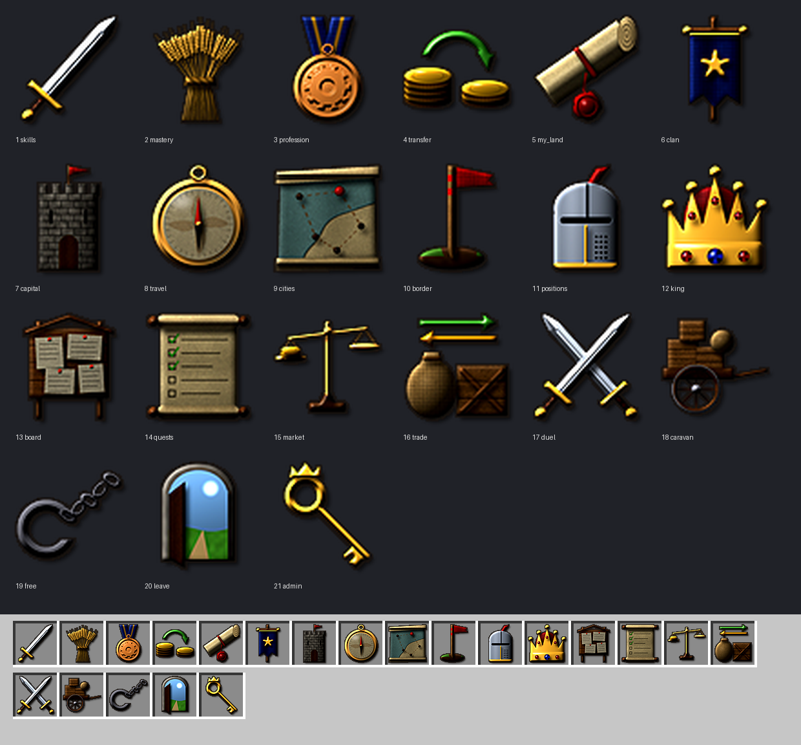
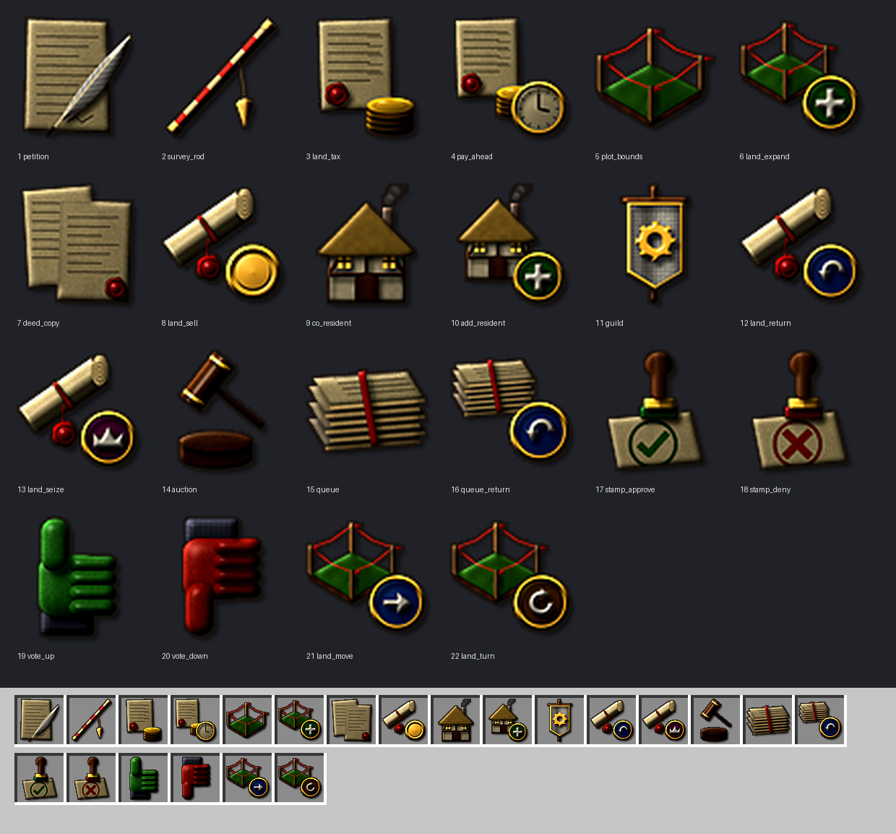
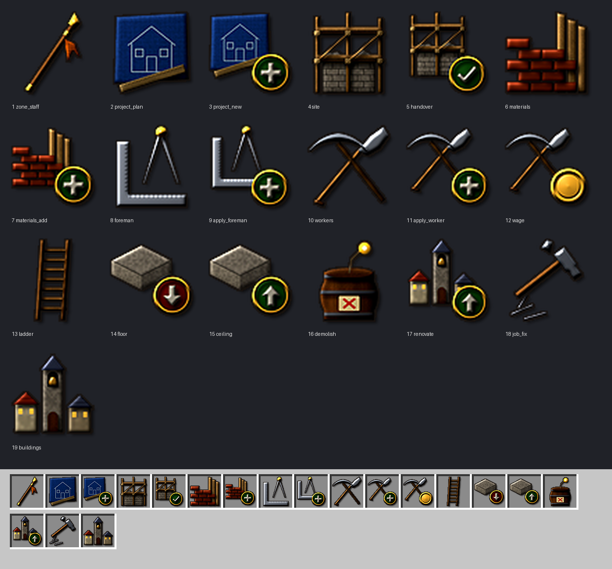
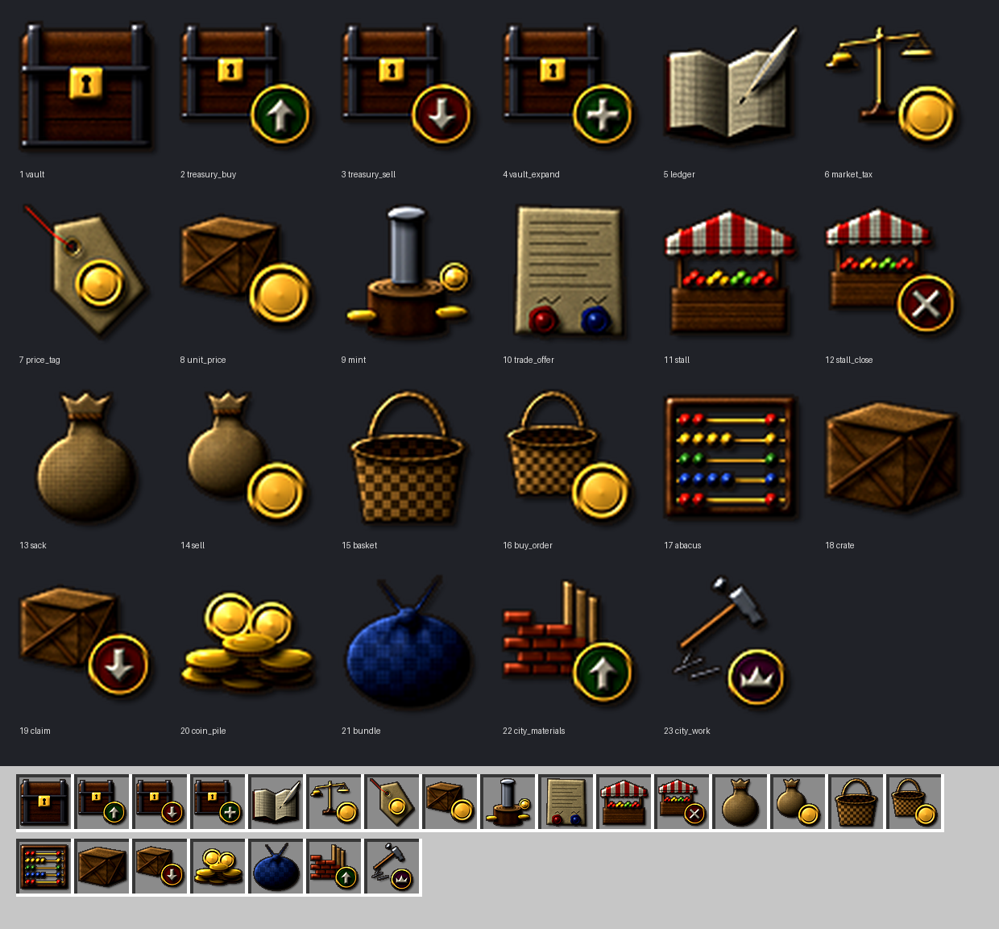
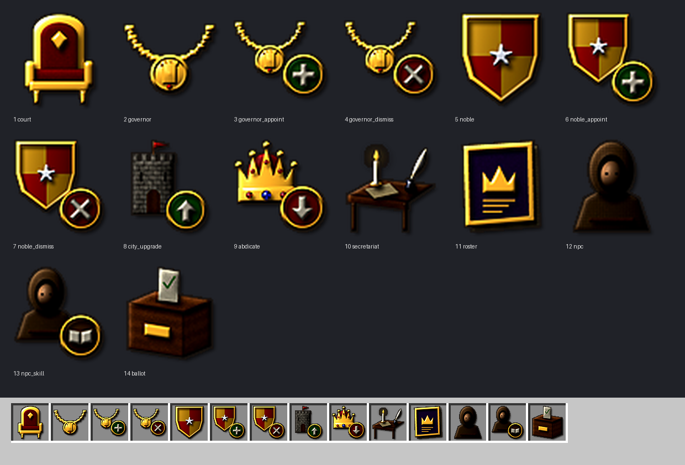
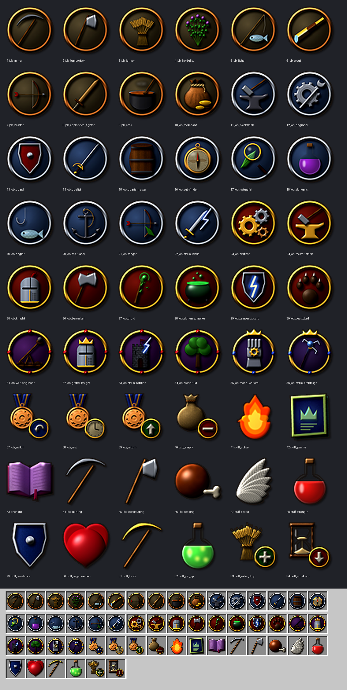
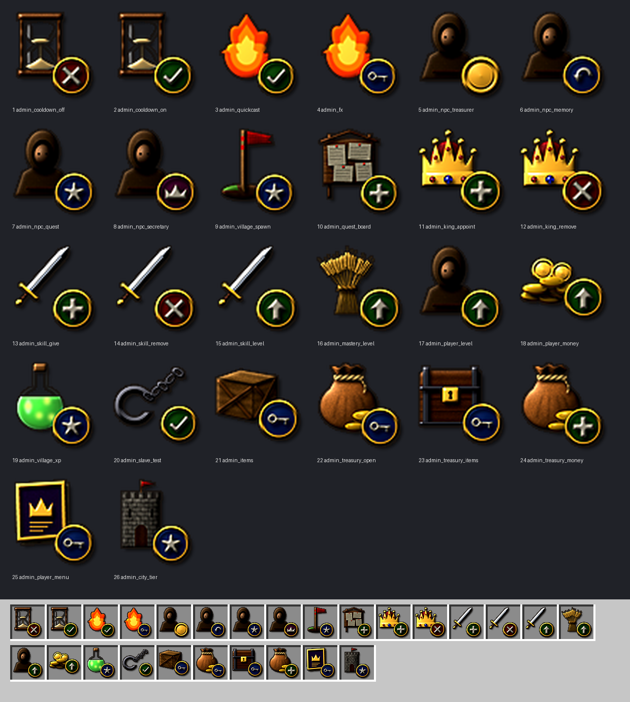
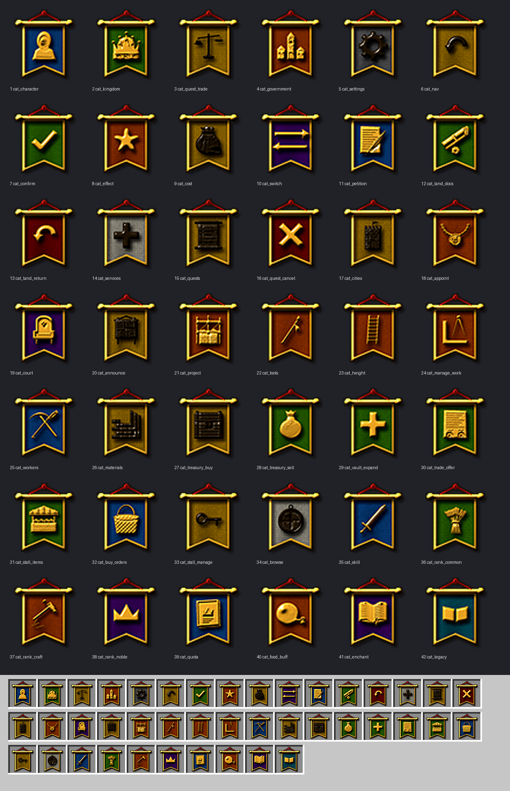

# Icon catalog

Generated by `tools/build.py` from `tools/stages.py` and each icon's docstring. Use the id as `knightsrealm:<id>` (the item_model of a menu button).

## Stage1 — ปุ่มกลาง (ทุกเมนู) (13)

| id | for / shows |
|---|---|
| `back` | ย้อนกลับ: an arrow of polished oak curving back over the top, head pointing down-left. |
| `close` | ปิดเมนู: an arched plank door, shut, with iron straps and a ring pull. |
| `confirm` | ยืนยัน: a green wax seal with a tick pressed into it. |
| `cancel` | ยกเลิก: a red wax seal with a cross pressed into it. |
| `deny` | ปฏิเสธ: a written document torn in two, the halves pulled apart. |
| `locked` | ทำไม่ได้ / ล็อก: an iron padlock, shackle closed. |
| `page_prev` | หน้าก่อน: a parchment leaf with an ink arrow pointing left. |
| `page_next` | หน้าถัดไป: a parchment leaf with an ink arrow pointing right. |
| `info` | รายละเอียด / วิธีใช้: an open book, pages bowing up from the spine. |
| `empty` | ว่าง / ไม่มีรายการ: an empty turned wooden bowl. |
| `type_in` | พิมพ์เอง: a goose quill standing in a glass inkwell. |
| `reset` | คืนค่า / เวลา: an hourglass in a turned wooden frame, sand running. |
| `treasury` | ท้องพระคลัง: a tied leather coin purse with a stack of gold coins (approved 2026-10-02). |

## Stage2 — เมนูหลัก (23)

| id | for / shows |
|---|---|
| `skills` | ทักษะ: a knight's sword, point up to the right. |
| `mastery` | ความชำนาญ: a sheaf of ripe wheat bound with a straw band. |
| `profession` | อาชีพ: a guild medal - a bronze medallion with a gear, hung on a ribbon. |
| `transfer` | โอนเงิน: gold passing from one stack of coins to another, along a curved arrow. |
| `my_land` | ที่ดินของฉัน: a land deed - a rolled parchment tied with a cord and sealed in red wax. |
| `clan` | แคลน: a clan banner - deep blue cloth with a gold star, hanging from a crossbar on a pole. |
| `capital` | กลับเมืองหลวง: the capital's keep - a stone tower with battlements, a gate and a pennant. |
| `travel` | เดินทาง: a brass pocket compass, lid open, needle pointing north. |
| `cities` | เมืองทั้งหมด: an unrolled map of the realm with towns, roads and a coastline. |
| `border` | ดูเขตเมือง: a surveyor's boundary stake driven into a mound, flying a red pennant. |
| `positions` | ตำแหน่ง: a steel great helm with a gold trim and a red plume - rank and office. |
| `king` | กษัตริย์: a gold crown set with rubies and a sapphire, on a red velvet cap. |
| `board` | กระดานประกาศ: a wooden notice board with papers pinned to it. |
| `quests` | เควส: an open scroll of tasks, the first ones ticked off. |
| `market` | ตลาด: a merchant's brass balance, one pan weighed down with gold. |
| `trade` | แลกของกับผู้เล่น: two goods crossing hands - a sack and a crate with exchange arrows. |
| `duel` | ดวล: two swords crossed, points up. |
| `caravan` | การค้าระหว่างเมือง: a merchant's two-wheeled cart loaded with crates and a sack. |
| `free` | ยกเลิกการเป็น Slave: an iron shackle and chain, the chain broken apart. |
| `leave` | ออกจากอาณาจักร: an arched doorway standing open onto bright daylight. |
| `admin` | Admin: the master key - a large gold key with a crowned bow. |
| `quickcast` | Quickcast (ปุ่มลัด Z/X/C/V): four ivory key caps marked Z X C V, a spark over the first. |
| `sidebar` | UI สถานะข้างจอ: a tall status tablet - a dark slate in a carved frame, a gold heading and coloured lines of figures down its side. |

## Stage3 — ที่ดิน (22)

| id | for / shows |
|---|---|
| `petition` | คำร้อง: a written petition with a quill laid across it. |
| `survey_rod` | ไม้รังวัด: a surveyor's measuring rod, banded every span, with a brass plumb bob on its cord. |
| `land_tax` | ภาษีที่ดิน: a tax notice under the city's red seal, with the coins that pay it. |
| `pay_ahead` | ชำระภาษีล่วงหน้า: the land_tax icon with a clock badge. |
| `plot_bounds` | ดูเขตที่ดิน: a plot of grass marked out by four corner stakes and a cord. |
| `land_expand` | ขอขยายที่ดิน: the plot_bounds icon with a plus badge. |
| `deed_copy` | รับสำเนาโฉนด: two copies of a deed, one over the other, both sealed. |
| `land_sell` | โอน/ขายที่ดิน: the my_land icon with a coin badge. |
| `co_resident` | ผู้ร่วมอาศัย: a timber-framed cottage under a thatched roof, smoke from the chimney. |
| `add_resident` | เพิ่มผู้ร่วมอาศัย: the co_resident icon with a plus badge. |
| `guild` | ผู้ร่วมก่อตั้งกิลด์: a guild banner - white cloth with a gold gear, on a crossbar. |
| `land_return` | คืนที่ดิน: the my_land icon with a back badge. |
| `land_seize` | เวนคืนที่ดิน (หลวงยึดคืน): the my_land icon with a crown badge. |
| `auction` | ขายทอดตลาด: an auctioneer's gavel striking its sounding block. |
| `queue` | คิวคำร้อง: a stack of petitions waiting, tied with a ribbon. |
| `queue_return` | คืนเข้าคิว: the queue icon with a back badge. |
| `stamp_approve` | อนุมัติ: a stamp that has just pressed a green tick onto the document. |
| `stamp_deny` | ปฏิเสธคำร้อง: a stamp that has just pressed a red cross onto the document. |
| `vote_up` | ถูกใจ: a gloved thumb up, green leather. |
| `vote_down` | ไม่ถูกใจ: a gloved thumb down, red leather. |
| `land_move` | ย้ายที่ดิน / จัดรูปที่ดิน: the plot_bounds icon with a blue arrow badge - the land goes elsewhere (2026-10-03). |
| `land_turn` | หมุนที่ดิน 90 องศา: the plot_bounds icon with an amber badge of a clockwise turning arrow (2026-10-03). |

## Stage4 — ก่อสร้าง + งานหลวง (19)

| id | for / shows |
|---|---|
| `zone_staff` | ไม้กำหนดเขตก่อสร้าง: a master builder's staff - oak, brass-shod, an orange marker cloth tied below its crown. |
| `project_plan` | ขั้นตอนโครงการ: a builder's plan - a blue drawing of a house front, a ruler laid on it. |
| `project_new` | โครงการใหม่: the project_plan icon with a plus badge. |
| `site` | เขตก่อสร้าง: timber scaffolding lashed together around a half-built stone wall. |
| `handover` | ส่งมอบงาน: the site icon with a check badge. |
| `materials` | วัสดุ: building stock - a stack of fired bricks with sawn planks leaning on it. |
| `materials_add` | เพิ่มวัสดุ: the materials icon with a plus badge. |
| `foreman` | หัวหน้างาน: the master builder's tools - an iron set square and a pair of dividers. |
| `apply_foreman` | สมัครเป็นหัวหน้างาน: the foreman icon with a plus badge. |
| `workers` | กรรมกร: a labourer's shovel and pickaxe, crossed. |
| `apply_worker` | สมัครเป็นกรรมกร: the workers icon with a plus badge. |
| `wage` | ค่าแรงต่อบล็อก: the workers icon with a coin badge. |
| `ladder` | ความสูงของเขต: a wooden ladder standing tall. |
| `floor` | ตั้งพื้นเขต: the slab icon with a down badge. |
| `ceiling` | ตั้งเพดานเขต: the slab icon with a up badge. |
| `demolish` | ทำลาย / ยุบ: a powder keg with a lit fuse. |
| `renovate` | สั่งแก้ไขต่อเติม: the buildings icon with a up badge. |
| `job_fix` | แก้ไขงาน: a carpenter's claw hammer over a few iron nails. |
| `buildings` | อาคารของเมือง: a row of town buildings - a hall with a bell tower between two houses. |

## Stage5 — เศรษฐกิจ (24)

| id | for / shows |
|---|---|
| `vault` | กล่องคลังหลวง: the royal strongbox - an oak chest bound in iron, a gold lock plate on the front. |
| `treasury_buy` | ซื้อจากคลัง: the vault icon with a up badge. |
| `treasury_sell` | ขายให้คลัง: the vault icon with a down badge. |
| `vault_expand` | ขยายคลัง: the vault icon with a plus badge. |
| `ledger` | บริหารคลัง: the treasury ledger - an open account book of ruled columns, a quill beside it. |
| `market_tax` | ภาษีตลาด: the market icon with a coin badge. |
| `price_tag` | ระดับราคา: a merchant's price tag - a card on a string, a coin marked on it. |
| `unit_price` | ราคาชิ้นละ: the crate icon with a coin badge (price per piece of goods). |
| `mint` | โรงกษาปณ์: the mint - a coining die on its anvil block, freshly struck coins around it. |
| `trade_offer` | ข้อเสนอการค้า: a trade agreement between two cities - one contract under two seals. |
| `stall` | แผงค้า: a market stall - a plank counter under a striped awning, wares on top. |
| `stall_close` | เลิกเช่าแผง: the stall icon with a x badge. |
| `sack` | ของขาย: a full grain sack, its neck tied with cord. |
| `sell` | ขายของ: the sack icon with a coin badge. |
| `basket` | รับซื้อ: an empty wicker basket waiting to be filled. |
| `buy_order` | รับซื้อ: the basket icon with a coin badge. |
| `abacus` | จำนวน: a counting frame - wooden beads on brass rods in an oak frame. |
| `crate` | ของรอรับ: a nailed-shut wooden crate of goods. |
| `claim` | รับของทั้งหมด: the crate icon with a down badge. |
| `coin_pile` | เงินที่ให้: a heap of gold coins. |
| `bundle` | ของที่ให้: goods wrapped in a cloth bundle, knotted on top. |
| `city_materials` | วัสดุเลื่อนขั้นเมือง: the materials icon with a up badge. |
| `city_work` | งานเมือง: the job_fix icon with a crown badge. |
| `citizen_tax` | ภาษีราษฎร: a head-tax roll - a citizen's name on the city's register under a red seal, and the coins due. |

## Stage6 — ราชการ + อาณาจักร (24)

| id | for / shows |
|---|---|
| `court` | ราชสำนัก: the throne - carved and gilded, a red cushion on the seat. |
| `governor` | เจ้าเมือง: the governor's chain of office - linked gold plates with a pendant medallion. |
| `governor_appoint` | แต่งตั้งเจ้าเมือง: the governor icon with a plus badge. |
| `governor_dismiss` | ปลดเจ้าเมือง: the governor icon with a x badge. |
| `noble` | ขุนนาง: a noble house's coat of arms - a quartered shield, red and gold, a gold rim. |
| `noble_appoint` | แต่งตั้งขุนนาง: the noble icon with a plus badge. |
| `noble_dismiss` | ปลดขุนนาง: the noble icon with a x badge. |
| `city_upgrade` | เลื่อนขั้นเมือง: the capital icon with a up badge. |
| `abdicate` | สละเมือง: the king icon with a down badge. |
| `secretariat` | สำนักเลขาธิการ: the secretary's writing desk - papers, an inkwell, a candle. |
| `roster` | ตำแหน่งในอาณาจักร: the realm's roll of offices - a bound register with a crown on its cover. |
| `npc` | NPC ประจำเมือง: a townsperson in a hooded cloak. |
| `npc_skill` | NPC ทักษะ: the npc icon with a book badge. |
| `ballot` | เสียงประชาชน: a sealed ballot box, a folded vote going in at the slot. |
| `decree` | ออกประกาศ: a royal proclamation - an unrolled parchment between two wooden rollers, lines of writing, a red crown seal. |
| `colony_flag` | ธงอาณานิคม: a kingdom banner on a tall pole, planted in a heap of fresh earth. |
| `colony_found` | ตั้งอาณานิคม: the colony banner with a plus badge. |
| `barracks` | ค่ายทหาร: a soldiers' camp - a canvas tent with a dark open flap inside a pointed wooden palisade, a red pennant on its pole. |
| `commander` | ผู้บัญชาการค่าย: a commander's steel helmet with a red plume, a gold-capped marshal's baton across behind it. |
| `bunk` | เตียงของฉัน: a soldier's plain wooden cot with a red wool blanket and a white pillow, seen from the foot corner. |
| `locker` | ขาตั้งเกราะของฉัน: an armour stand on its wooden cross - a steel helmet and breastplate hung on it, a small brass key tag. |
| `royal_petition` | ฎีกา / ศาลาฎีกา: the brass bell the people ring to be heard, over a petition scroll tied with red cord. |
| `bug_report` | ฎีกาหมวดบั๊ก: a black beetle crawling across a written report. |
| `idea` | ฎีกาหมวดข้อเสนอแนะ: a brass oil lamp burning - a bright idea in a medieval hand. |

## Stage7 — ทักษะ / อาชีพ (56)

| id | for / shows |
|---|---|
| `job_miner` | Job emblem: miner - its tool inside the Tier medallion (see _tools.py). |
| `job_lumberjack` | Job emblem: lumberjack - its tool inside the Tier medallion (see _tools.py). |
| `job_farmer` | Job emblem: farmer - its tool inside the Tier medallion (see _tools.py). |
| `job_herbalist` | Job emblem: herbalist - its tool inside the Tier medallion (see _tools.py). |
| `job_fisher` | Job emblem: fisher - its tool inside the Tier medallion (see _tools.py). |
| `job_scout` | Job emblem: scout - its tool inside the Tier medallion (see _tools.py). |
| `job_hunter` | Job emblem: hunter - its tool inside the Tier medallion (see _tools.py). |
| `job_apprentice_fighter` | Job emblem: apprentice_fighter - its tool inside the Tier medallion (see _tools.py). |
| `job_cook` | Job emblem: cook - its tool inside the Tier medallion (see _tools.py). |
| `job_merchant` | Job emblem: merchant - its tool inside the Tier medallion (see _tools.py). |
| `job_blacksmith` | Job emblem: blacksmith - its tool inside the Tier medallion (see _tools.py). |
| `job_engineer` | Job emblem: engineer - its tool inside the Tier medallion (see _tools.py). |
| `job_guard` | Job emblem: guard - its tool inside the Tier medallion (see _tools.py). |
| `job_duelist` | Job emblem: duelist - its tool inside the Tier medallion (see _tools.py). |
| `job_quartermaster` | Job emblem: quartermaster - its tool inside the Tier medallion (see _tools.py). |
| `job_pathfinder` | Job emblem: pathfinder - its tool inside the Tier medallion (see _tools.py). |
| `job_naturalist` | Job emblem: naturalist - its tool inside the Tier medallion (see _tools.py). |
| `job_alchemist` | Job emblem: alchemist - its tool inside the Tier medallion (see _tools.py). |
| `job_angler` | Job emblem: angler - its tool inside the Tier medallion (see _tools.py). |
| `job_sea_trader` | Job emblem: sea_trader - its tool inside the Tier medallion (see _tools.py). |
| `job_ranger` | Job emblem: ranger - its tool inside the Tier medallion (see _tools.py). |
| `job_storm_blade` | Job emblem: storm_blade - its tool inside the Tier medallion (see _tools.py). |
| `job_artificer` | Job emblem: artificer - its tool inside the Tier medallion (see _tools.py). |
| `job_master_smith` | Job emblem: master_smith - its tool inside the Tier medallion (see _tools.py). |
| `job_knight` | Job emblem: knight - its tool inside the Tier medallion (see _tools.py). |
| `job_berserker` | Job emblem: berserker - its tool inside the Tier medallion (see _tools.py). |
| `job_druid` | Job emblem: druid - its tool inside the Tier medallion (see _tools.py). |
| `job_alchemy_master` | Job emblem: alchemy_master - its tool inside the Tier medallion (see _tools.py). |
| `job_tempest_guard` | Job emblem: tempest_guard - its tool inside the Tier medallion (see _tools.py). |
| `job_beast_lord` | Job emblem: beast_lord - its tool inside the Tier medallion (see _tools.py). |
| `job_war_engineer` | Job emblem: war_engineer - its tool inside the Tier medallion (see _tools.py). |
| `job_grand_knight` | Job emblem: grand_knight - its tool inside the Tier medallion (see _tools.py). |
| `job_storm_sentinel` | Job emblem: storm_sentinel - its tool inside the Tier medallion (see _tools.py). |
| `job_archdruid` | Job emblem: archdruid - its tool inside the Tier medallion (see _tools.py). |
| `job_mech_warlord` | Job emblem: mech_warlord - its tool inside the Tier medallion (see _tools.py). |
| `job_storm_archmage` | Job emblem: storm_archmage - its tool inside the Tier medallion (see _tools.py). |
| `job_switch` | เปลี่ยนสายทักษะ: the profession icon with a back badge. |
| `job_rest` | พักไว้ทั้งสาย: the profession icon with a clock badge. |
| `job_return` | ได้ใช้ (กลับมาใช้): the profession icon with a up badge. |
| `apply_profession` | สมัครอาชีพ: the guild medal of อาชีพ with a plus badge. |
| `resign_profession` | ลาออกจากอาชีพ: the guild medal of อาชีพ with a minus badge. |
| `bag_empty` | กระเป๋าไร้ก้นต้องว่าง: the sack icon with a minus badge. |
| `skill_active` | สกิล Active: a burning orb. |
| `skill_passive` | สกิล Passive: a glowing rune tome. |
| `enchant` | enchant (ตีบวก): a glowing enchanted book. |
| `life_mining` | ความชำนาญ ขุดแร่: a pickaxe. |
| `life_woodcutting` | ความชำนาญ ตัดไม้: an axe. |
| `life_cooking` | ความชำนาญ ปรุงอาหาร: a roast joint. |
| `buff_speed` | บัฟ ว่องไว: a white wing. |
| `buff_strength` | บัฟ พละกำลัง: a red draught. |
| `buff_resistance` | บัฟ ทนทาน: a shield. |
| `buff_regeneration` | บัฟ ฟื้นฟู: a glowing heart. |
| `buff_haste` | บัฟ มือไว: a gold pickaxe. |
| `buff_job_xp` | บัฟ Job XP: a bottle of green sparks. |
| `buff_extra_drop` | บัฟ ของดรอปเพิ่ม: the mastery icon with a plus badge. |
| `buff_cooldown` | บัฟ คูลดาวน์สั้นลง: the reset icon with a down badge. |

## Stage8 — Admin (26)

| id | for / shows |
|---|---|
| `admin_cooldown_off` | คูลดาวน์สกิล OP: ปิด (Admin): the reset icon with a x badge. |
| `admin_cooldown_on` | คูลดาวน์สกิล OP: เปิด (Admin): the reset icon with a check badge. |
| `admin_quickcast` | ตรวจ Quickcast (Admin): the skill_active icon with a check badge. |
| `admin_fx` | ปรับเอฟเฟกต์ (Admin): the skill_active icon with a key badge. |
| `admin_npc_treasurer` | ตั้ง NPC ขุนคลัง (Admin): the npc icon with a coin badge. |
| `admin_npc_memory` | ตั้ง NPC ผู้ชำระความทรงจำ (Admin): the npc icon with a back badge. |
| `admin_npc_quest` | ตั้ง NPC ผู้รับส่งเควส (Admin): the npc icon with a star badge. |
| `admin_npc_secretary` | ตั้ง NPC เลขาธิการ (Admin): the npc icon with a crown badge. |
| `admin_village_spawn` | ตั้งจุดเกิดหมู่บ้าน (Admin): the border icon with a star badge. |
| `admin_quest_board` | ตั้งป้ายบอร์ดเควส (Admin): the board icon with a plus badge. |
| `admin_king_appoint` | แต่งตั้งกษัตริย์ (Admin): the king icon with a plus badge. |
| `admin_king_remove` | ถอดกษัตริย์ (Admin): the king icon with a x badge. |
| `admin_skill_give` | มอบทักษะ (Admin): the skills icon with a plus badge. |
| `admin_skill_remove` | ถอนทักษะ (Admin): the skills icon with a x badge. |
| `admin_skill_level` | ปรับ Level ทักษะ (Admin): the skills icon with a up badge. |
| `admin_mastery_level` | ปรับ Level ความชำนาญ (Admin): the mastery icon with a up badge. |
| `admin_player_level` | ปรับ Level ผู้เล่น (Admin): the npc icon with a up badge. |
| `admin_player_money` | ปรับเงินผู้เล่น (Admin): the coin_pile icon with a up badge. |
| `admin_village_xp` | ปรับ EXP หมู่บ้าน (Admin): the buff_job_xp icon with a star badge. |
| `admin_slave_test` | ทดสอบสถานะ Slave (Admin): the free icon with a check badge. |
| `admin_items` | หยิบไอเทม (OP) (Admin): the crate icon with a key badge. |
| `admin_treasury_open` | เปิดท้องพระคลัง (Admin): the treasury icon with a key badge. |
| `admin_treasury_items` | เพิ่ม/หักของในคลัง (Admin): the vault icon with a key badge. |
| `admin_treasury_money` | เพิ่ม/หักเงินคลัง (Admin): the treasury icon with a plus badge. |
| `admin_player_menu` | เมนูผู้เล่น (ราชการ) (Admin): the roster icon with a key badge. |
| `admin_city_tier` | เลื่อน/ลดขั้นเมือง (Admin): the capital icon with a star badge. |

## Stage9 — หมวดหมู่ (ป้ายซ้ายแถว, ตัวหนังสือ) (75)

| id | for / shows |
|---|---|
| `cat_character` | หมวด "ตัวละคร" (ตัวละคร): light blue ribbon with the words. Generated from categories.tsv. |
| `cat_kingdom` | หมวด "อาณาจักร" (อาณาจักร): lime ribbon with the words. Generated from categories.tsv. |
| `cat_quest_trade` | หมวด "เควส การค้า" (เควส & การค้า): yellow ribbon with the words. Generated from categories.tsv. |
| `cat_government` | หมวด "ราชการ" (ราชการ, งานของเมือง, งานเมือง): orange ribbon with the words. Generated from categories.tsv. |
| `cat_settings` | หมวด "ตั้งค่า" (ตั้งค่า): light gray ribbon with the words. Generated from categories.tsv. |
| `cat_nav` | หมวด "นำทาง" (นำทาง): yellow ribbon with the words. Generated from categories.tsv. |
| `cat_confirm` | หมวด "ยืนยัน" (ยืนยัน, ตัดสินใจ): lime ribbon with the words. Generated from categories.tsv. |
| `cat_effect` | หมวด "ผลลัพธ์" (ผลที่จะเกิด): orange ribbon with the words. Generated from categories.tsv. |
| `cat_cost` | หมวด "ค่าใช้จ่าย" (ค่าใช้จ่าย, ภาษี ราคา โรงกษาปณ์): yellow ribbon with the words. Generated from categories.tsv. |
| `cat_switch` | หมวด "เปลี่ยนสาย" (เปลี่ยนสาย): purple ribbon with the words. Generated from categories.tsv. |
| `cat_petition` | หมวด "คำร้อง" (คำร้อง): light blue ribbon with the words. Generated from categories.tsv. |
| `cat_my_petitions` | หมวด "คำร้อง ของฉัน" (คำร้องของฉัน, คำร้องที่รอตรวจ): white ribbon with the words. Generated from categories.tsv. |
| `cat_land_docs` | หมวด "เอกสาร" (ภาษีและเอกสาร): lime ribbon with the words. Generated from categories.tsv. |
| `cat_land_return` | หมวด "คืนที่ดิน" (คืนที่ดิน): red ribbon with the words. Generated from categories.tsv. |
| `cat_services` | หมวด "อื่นๆ" (บริการอื่น): white ribbon with the words. Generated from categories.tsv. |
| `cat_quests` | หมวด "เควส" (เควส): yellow ribbon with the words. Generated from categories.tsv. |
| `cat_quest_cancel` | หมวด "ยกเลิก" (ยกเลิกเควส): red ribbon with the words. Generated from categories.tsv. |
| `cat_cities` | หมวด "เมือง" (เมืองและเจ้าเมือง): yellow ribbon with the words. Generated from categories.tsv. |
| `cat_appoint` | หมวด "แต่งตั้ง" (แต่งตั้ง / ปลด): orange ribbon with the words. Generated from categories.tsv. |
| `cat_court` | หมวด "ราชสำนัก" (ราชสำนัก): purple ribbon with the words. Generated from categories.tsv. |
| `cat_announce` | หมวด "ประกาศ" (ประกาศ): yellow ribbon with the words. Generated from categories.tsv. |
| `cat_project` | หมวด "โครงการ" (โครงการ, จัดการโครงการ, ขั้นตอนโครงการ): orange ribbon with the words. Generated from categories.tsv. |
| `cat_project_status` | หมวด "สถานะ" (สถานะโครงการ): white ribbon with the words. Generated from categories.tsv. |
| `cat_tools` | หมวด "เครื่องมือ" (เครื่องมือ): orange ribbon with the words. Generated from categories.tsv. |
| `cat_height` | หมวด "ความสูง" (ความสูงของเขต): orange ribbon with the words. Generated from categories.tsv. |
| `cat_manage_work` | หมวด "จัดการ" (จัดการงาน): orange ribbon with the words. Generated from categories.tsv. |
| `cat_workers` | หมวด "กรรมกร" (กรรมกร): light blue ribbon with the words. Generated from categories.tsv. |
| `cat_materials` | หมวด "วัสดุ" (วัสดุ): yellow ribbon with the words. Generated from categories.tsv. |
| `cat_treasury_buy` | หมวด "ซื้อ" (ซื้อจากคลัง): yellow ribbon with the words. Generated from categories.tsv. |
| `cat_treasury_sell` | หมวด "ขาย" (ขายให้คลัง): lime ribbon with the words. Generated from categories.tsv. |
| `cat_vault_expand` | หมวด "ขยายคลัง" (ขยายคลัง): lime ribbon with the words. Generated from categories.tsv. |
| `cat_trade_offer` | หมวด "ข้อเสนอ" (ข้อเสนอการค้า): lime ribbon with the words. Generated from categories.tsv. |
| `cat_stall_items` | หมวด "รายการ" (รายการ, สินค้าที่วางขาย): lime ribbon with the words. Generated from categories.tsv. |
| `cat_buy_orders` | หมวด "รับซื้อ" (มีคนรับซื้อ): light blue ribbon with the words. Generated from categories.tsv. |
| `cat_stall_manage` | หมวด "จัดการแผง" (จัดการแผง): yellow ribbon with the words. Generated from categories.tsv. |
| `cat_browse` | หมวด "เลือกดู" (เลือกดู): white ribbon with the words. Generated from categories.tsv. |
| `cat_skill` | หมวด "ทักษะ" (ทักษะ): light blue ribbon with the words. Generated from categories.tsv. |
| `cat_rank_common` | หมวด "สามัญ" (ชั้นสามัญ): lime ribbon with the words. Generated from categories.tsv. |
| `cat_rank_craft` | หมวด "ช่าง" (ชั้นช่าง): orange ribbon with the words. Generated from categories.tsv. |
| `cat_rank_noble` | หมวด "ขุนนาง" (ชั้นขุนนาง): purple ribbon with the words. Generated from categories.tsv. |
| `cat_quota` | หมวด "โควตา" (โควตาของอาชีพ): light blue ribbon with the words. Generated from categories.tsv. |
| `cat_food_buff` | หมวด "บัฟอาหาร" (บัฟอาหาร): orange ribbon with the words. Generated from categories.tsv. |
| `cat_enchant` | หมวด "enchant" (enchant): purple ribbon with the words. Generated from categories.tsv. |
| `cat_legacy` | หมวด "สกิลมรดก" (สกิลของ): cyan ribbon with the words. Generated from categories.tsv. |
| `cat_my_land` | หมวด "ที่ดิน ของฉัน" (ที่ดินของฉัน, เป็นเจ้าของ): lime ribbon with the words. Generated from categories.tsv. |
| `cat_request_land` | หมวด "ขอที่ดิน" (ขอที่ดิน): yellow ribbon with the words. Generated from categories.tsv. |
| `cat_landlord` | หมวด "เจ้าที่ดิน" (โต๊ะเจ้าที่ดิน): orange ribbon with the words. Generated from categories.tsv. |
| `cat_residents` | หมวด "ร่วมอาศัย" (ผู้ร่วมอาศัย, ร่วมอาศัย): light blue ribbon with the words. Generated from categories.tsv. |
| `cat_public_voice` | หมวด "เสียง ประชาชน" (เสียงประชาชน): yellow ribbon with the words. Generated from categories.tsv. |
| `cat_nobles` | หมวด "ขุนนาง" (ขุนนาง): orange ribbon with the words. Generated from categories.tsv. |
| `cat_jobs_apply` | หมวด "สมัครงาน" (สมัครงาน): light blue ribbon with the words. Generated from categories.tsv. |
| `cat_jobs_start` | หมวด "เริ่มงาน" (เริ่มงาน): yellow ribbon with the words. Generated from categories.tsv. |
| `cat_deal_mine` | หมวด "ของที่ คุณให้" (ของที่คุณให้): lime ribbon with the words. Generated from categories.tsv. |
| `cat_deal_theirs` | หมวด "ของอีก ฝ่าย" (ของที่): orange ribbon with the words. Generated from categories.tsv. |
| `cat_city_land` | หมวด "ที่ดิน ของเมือง" (ที่ดินของเมือง): lime ribbon with the words. Generated from categories.tsv. |
| `cat_land_move` | หมวด "ย้ายที่ดิน" (ย้ายที่ดิน): light blue ribbon with the words. Generated from categories.tsv. |
| `cat_land_readjust` | หมวด "ปรับที่ใหม่" (ปรับที่ใหม่): orange ribbon with the words. Generated from categories.tsv. |
| `cat_village` | หมวด "หมู่บ้าน" (หมู่บ้าน): lime ribbon with the words. Generated from categories.tsv. |
| `cat_players` | หมวด "ผู้เล่น" (ผู้เล่น): light blue ribbon with the words. Generated from categories.tsv. |
| `cat_delete` | หมวด "ลบข้อมูล" (ลบข้อมูล): red ribbon with the words. Generated from categories.tsv. |
| `cat_system` | หมวด "ระบบ" (ระบบ): light gray ribbon with the words. Generated from categories.tsv. |
| `cat_treasury_kingdom` | หมวด "คลัง อาณาจักร" (คลัง & อาณาจักร): yellow ribbon with the words. Generated from categories.tsv. |
| `cat_apply` | หมวด "สมัคร อาชีพ" (สมัครอาชีพ): light blue ribbon with the words. Generated from categories.tsv. |
| `cat_my_bunk` | หมวด "ค่าย ของฉัน" (ค่ายของฉัน): yellow ribbon with the words. Generated from categories.tsv. |
| `cat_soldiers` | หมวด "ทหาร ในค่าย" (ทหารในค่าย): orange ribbon with the words. Generated from categories.tsv. |
| `cat_tax` | หมวด "ภาษี" (ภาษีของฉัน, ตารางภาษีราษฎร): yellow ribbon with the words. Generated from categories.tsv. |
| `cat_petition_file` | หมวด "ยื่น ฎีกา" (ยื่นฎีกา): white ribbon with the words. Generated from categories.tsv. |
| `cat_petition_board` | หมวด "ฎีกา ราษฎร" (ฎีกาของราษฎร): yellow ribbon with the words. Generated from categories.tsv. |
| `cat_petition_mine` | หมวด "ฎีกา ของฉัน" (ฎีกาของฉัน): white ribbon with the words. Generated from categories.tsv. |
| `cat_petition_admin` | หมวด "จัดการ ฎีกา" (จัดการฎีกา): red ribbon with the words. Generated from categories.tsv. |
| `cat_petition_status` | หมวด "สถานะ" (สถานะฎีกา): light blue ribbon with the words. Generated from categories.tsv. |
| `cat_petition_reply` | หมวด "ตอบ กลับ" (ตอบกลับ): white ribbon with the words. Generated from categories.tsv. |
| `cat_petition_reward` | หมวด "รางวัล" (รางวัลฎีกา): yellow ribbon with the words. Generated from categories.tsv. |
| `cat_civic` | หมวด "ส่วนร่วม กับเมือง" (การมีส่วนร่วมกับเมือง): cyan ribbon with the words. Generated from categories.tsv. |
| `cat_civic_sources` | หมวด "ได้ คะแนนจาก" (ได้คะแนนจาก): lime ribbon with the words. Generated from categories.tsv. |

## Not in a stage

- `civic`
